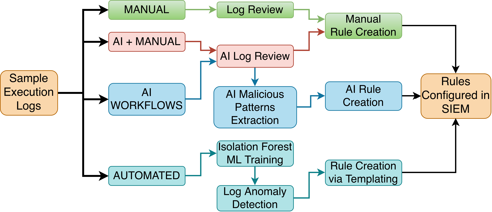

# Detection Rules

There are 3 rule authoring methodologies:

- Manual Log Review + Manual Rule Creation: [Manual Detections (MAN)](./manual/)
- AI Log Review + Manual Rule Creation: [Manual + AI Detections (MAI)](./manual_ai/)
- AI Log Review + AI Rule Creation: [AI Workflows (AIW)](./ai_workflows/)

Each folder contains a 8 folders with 4 files each. - 3 Sigma YAML files, 2 detections and 1 correlation of one or both detections. - 1 XML file that is the translation of the Sigma YAML files into Wazuh XML (ossec) detection language. This is the file that is tested.

## Tracking

- Manual rules created (in Sigma), transalted to Wazuh (XML), and performed targeted testing between August 3rd and August 6th.
- Manual AI rules created in Sigma, Translated to Wazuh (August 6th). Rules targeted tested August 7th.
- AI Workflows rules created between the 7th and 8th of August. Targeted testing completed August 9th.
