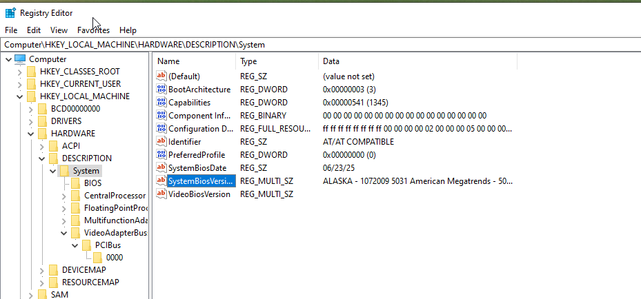

To prevent Sandbox and VM detection, I am using VBoxManage to edit vm details to match realistic data. VBoxCloak as a powershell command that will rename services and registry keys so everything keeps working but instead of having paths and RegKeys with strings like "VBox" and "VirtualBox" they get replaced with random strings.

Finally, using pafish to confirm that the sandbox passes the majority tests. It does not mean that malware won't detect the sandbox, it will just be less likely.

## VBoxManage Steps

ref: https://docs.oracle.com/en/virtualization/virtualbox/6.0/admin/changedmi.html

### Pulling Real References to use

To avoid detection in the sandbox, realistic values have to be used in certain VM configurations. I am using my desktop computer to extract realistic values using the following commands:

```powershell
Get-CimInstance Win32_BIOS
(Get-CimInstance Win32_BIOS).ReleaseDate

Get-CimInstance Win32_ComputerSystemProduct | Select-Object Vendor, Name, Version, IdentifyingNumber, UUID

Get-CimInstance Win32_BaseBoard
(Get-CimInstance Win32_BaseBoard).Version

Get-PhysicalDisk | Select-Object FriendlyName, SerialNumber
```

Result:

```powershell
PS C:\Users\david> Get-CimInstance Win32_BIOS
SMBIOSBIOSVersion : 5031
Manufacturer      : American Megatrends Inc.
Name              : 5031
SerialNumber      : System Serial Number
Version           : ALASKA - 1072009

PS C:\Users\david> (Get-CimInstance Win32_BIOS).ReleaseDate
Monday 13 January 2025 00:00:00

PS C:\Users\david> Get-CimInstance Win32_ComputerSystemProduct | Select-Object Vendor,Name,Version,IdentifyingNumber,UUID
Vendor            : System manufacturer
Name              : System Product Name
Version           : System Version
IdentifyingNumber : System Serial Number
UUID              : AC22CC69-902D-A1BA-BE21-244BFE9729F8

PS C:\Users\david> Get-CimInstance Win32_BaseBoard
Manufacturer : ASUSTeK COMPUTER INC.
Model        :
Name         : Base Board
SerialNumber : 200771758901460
SKU          :
Product      : ROG STRIX X570-F GAMING

PS C:\Users\david> Get-PhysicalDisk | Select-Object FriendlyName,SerialNumber
FriendlyName                   SerialNumber
------------                   ------------
CT500P3PSSD8                   6479_A76D_4000_0176.
Samsung SSD 970 EVO Plus 500GB 0025_385A_01B1_6F7E.
```

### Using VBoxManage to Change Values

#### 1. MAC Address

VirtualBox uses the same starting value for the MAC address always: 08-00-27. It is simple for malware to check that. To change it, I use the 3 first values for my real MAC (Ethernet adapter): `24-4B-FE` which is an Intel OUI, and then 3 arbitrary values that do not match my real MAC (`90-22-F6`).

```powershell
.\VBoxManage.exe modifyvm "Windows10" --macaddress1 244BFE9022F6
```

#### 2. BIOS / DMI Strings

The output of the following command is BIOS, the `pcbios` (Legacy BIOS boot uses `pcbios/0/Config`).

```
PS C:\Program Files\Oracle\VirtualBox> .\VBoxManage.exe showvminfo "Windows10" | findstr /i firmware
Firmware:                    BIOS
```

Commands:

```powershell
.\VBoxManage.exe setextradata "Windows10" "VBoxInternal/Devices/pcbios/0/Config/DmiBIOSVendor" "American Megatrends Inc."
.\VBoxManage.exe setextradata "Windows10" "VBoxInternal/Devices/pcbios/0/Config/DmiBIOSVersion" "5031"
.\VBoxManage.exe setextradata "Windows10" "VBoxInternal/Devices/pcbios/0/Config/DmiBIOSReleaseDate" "01/13/2025"
.\VBoxManage.exe setextradata "Windows10" "VBoxInternal/Devices/pcbios/0/Config/DmiSystemVendor" "System manufacturer"
.\VBoxManage.exe setextradata "Windows10" "VBoxInternal/Devices/pcbios/0/Config/DmiSystemProduct" "System Product Name"
.\VBoxManage.exe setextradata "Windows10" "VBoxInternal/Devices/pcbios/0/Config/DmiSystemVersion" "System Version"
.\VBoxManage.exe setextradata "Windows10" "VBoxInternal/Devices/pcbios/0/Config/DmiSystemSerial" "System Serial Number"
.\VBoxManage.exe setextradata "Windows10" "VBoxInternal/Devices/pcbios/0/Config/DmiSystemUuid" "AC22CC69-902D-A1BA-BE21-244BFE9729F8"
.\VBoxManage.exe setextradata "Windows10" "VBoxInternal/Devices/pcbios/0/Config/DmiBoardVendor" "ASUSTeK COMPUTER INC."
.\VBoxManage.exe setextradata "Windows10" "VBoxInternal/Devices/pcbios/0/Config/DmiBoardProduct" "ROG STRIX X570-F GAMING"
.\VBoxManage.exe setextradata "Windows10" "VBoxInternal/Devices/pcbios/0/Config/DmiBoardSerial" "200771758901460"
```

Issue fixed for DmiBIOSVersion and DmiBoardSerial not recognised as strings: VERR_CFGM_NOT_STRING
Refs:

- https://github.com/nsmfoo/antivmdetection/issues/36
- https://docs.oracle.com/en/virtualization/virtualbox/6.0/admin/changedmi.html

```powershell
.\VBoxManage.exe setextradata "Windows10" "VBoxInternal/Devices/pcbios/0/Config/DmiBIOSVersion" "string:5031"
.\VBoxManage.exe setextradata "Windows10" "VBoxInternal/Devices/pcbios/0/Config/DmiBoardSerial" "string:200771758901460"
```

**VM verified. Still starts.**

#### 3. Hypervisor CPUID Leaf

This is an attempt to remove the CPUID-visible hypervisor-present bit and vendor string ("VBoxVBoxVBox").

```powershell
.\VBoxManage.exe modifyvm "Windows10" --paravirtprovider none
```

This caused the machine to fail to boot and be usable so it was reverted by:

```powershell
.\VBoxManage.exe modifyvm "Windows10" --paravirtprovider default
```

#### 4. Disk Identifiers

If checked, I want the disk identifiers to be realistic. SATA is used in the machine so `ahci` is the controlelr:

```powershell
.\VBoxManage.exe setextradata "Windows10" "VBoxInternal/Devices/ahci/0/Config/Port0/ModelNumber" "CT500P3PSSD8"
.\VBoxManage.exe setextradata "Windows10" "VBoxInternal/Devices/ahci/0/Config/Port0/SerialNumber" "6479_A76D_4000_0176"
.\VBoxManage.exe setextradata "Windows10" "VBoxInternal/Devices/ahci/0/Config/Port0/FirmwareRevision" "P9CR40A"
```

\* using the most common Firmware revision for that drive: CT500P3PSSD8.
Ref: https://smarthdd.com/database/CT500P3PSSD8/

Machine starts fine after.

#### 5. TSC Timing / CPU Feature Flags

These are officially undocumented settings that I have used in the past.

- `TSCMode RealTSCOffset` ties the guest's Time Stamp Counter to the host's real hardware TSC (fixed offset) instead of VirtualBox's default virtualised counter; this is an attempt to defeat anti-vm detection `RDTSC → CPUID → RDTSC` timing-delta checks.
- `CPUM/SSE4.1` / `CPUM/SSE4.2` force those CPUID feature bits on.

```powershell
.\VBoxManage.exe setextradata "Windows10" "VBoxInternal/TM/TSCMode" "RealTSCOffset"
.\VBoxManage.exe setextradata "Windows10" "VBoxInternal/CPUM/SSE4.1" 1
.\VBoxManage.exe setextradata "Windows10" "VBoxInternal/CPUM/SSE4.2" 1
```

Refs:

- https://github.com/vektort13/antiRTSC
- https://forums.virtualbox.org/viewtopic.php?f=1&t=85261

## Disabling Windows Defender

Ref: https://superuser.com/questions/1757339/how-to-permanently-disable-windows-defender-real-time-protection-with-gpo/1757341##1757341

1. Open Windows Security (type Windows Security in the search box)
2. Virus & threat protection > Virus & threat protection settings > Manage settings
3. Switch Tamper Protection to Off

4. To permanently disable real-time protection:
   1. Open Local Group Policy Editor (type gpedit.msc in the search box)
   2. Computer Configuration > Administrative Templates > Windows Components > Microsoft Defender Antivirus > Real-time Protection
   3. Enable Turn off real-time protection
   4. Restart the computer

5. To permanently disable Microsoft Defender:
   1. Open Local Group Policy Editor (type gpedit.msc in the search box)
   2. Computer Configuration > Administrative Templates > Windows Components > Microsoft Defender Antivirus
   3. Enable Turn off Microsoft Defender Antivirus
   4. Restart the computer

## VBoxCloak

Run as per documented. Ref: https://github.com/d4rksystem/VBoxCloak

## Other items

Edited manually some values for the RegistryKeys in the VMs: 

The following values were changed from the default values to what the iamge shows:

- `HKLM\HARDWARE\DESCRIPTION\System\SystemBiosVersion` -> "ALASKA - 1072009 5031 American Megatrends - 5031"
- `HKLM\HARDWARE\DESCRIPTION\System\SystemBiosDate` -> "06/32/2025"
- `HKLM\HARDWARE\DESCRIPTION\System\VideoBiosVersion` -> "" (empty string)

## Hardening results

After hardening the VM, a 55% percent improvement was seen (from 18 traces to 8) in Pafish. Ref: https://github.com/a0rtega/pafish

### BEFORE

```powershell
* Pafish (Paranoid Fish) *

[-] Windows version: 6.2 build 9200
[-] Running in WoW64: False
[-] CPU: AuthenticAMD
    Hypervisor: VBoxVBoxVBox
    CPU brand: AMD Ryzen 9 5900X 12-Core Processor

[-] Debuggers detection
[*] Using IsDebuggerPresent() ... OK
[*] Using BeingDebugged via PEB access ... OK

[-] CPU information based detections
[*] Checking the difference between CPU timestamp counters (rdtsc) ... OK
[*] Checking the difference between CPU timestamp counters (rdtsc) forcing VM exit ... traced!
[*] Checking hypervisor bit in cpuid feature bits ... traced!
[*] Checking cpuid hypervisor vendor for known VM vendors ... traced!

[-] Generic reverse turing tests
[*] Checking mouse presence ... OK
[*] Checking mouse movement ... OK
[*] Checking mouse speed ... OK
[*] Checking mouse click activity ... traced!
[*] Checking mouse double click activity ... traced!
[*] Checking dialog confirmation ... traced!
[*] Checking plausible dialog confirmation ... traced!

[-] Generic sandbox detection
[*] Checking username ... OK
[*] Checking file path ... OK
[*] Checking common sample names in drives root ... OK
[*] Checking if disk size <= 60GB via DeviceIoControl() ... OK
[*] Checking if disk size <= 60GB via GetDiskFreeSpaceExA() ... traced!
[*] Checking if Sleep() is patched using GetTickCount() ... OK
[*] Checking if NumberOfProcessors is < 2 via PEB access ... OK
[*] Checking if NumberOfProcessors is < 2 via GetSystemInfo() ... OK
[*] Checking if pysical memory is < 1Gb ... OK
[*] Checking operating system uptime using GetTickCount() ... traced!
[*] Checking if operating system IsNativeVhdBoot() ... OK

[-] Sandboxie detection
[*] Using GetModuleHandle(sbiedll.dll) ... OK

[-] Wine detection
[*] Using GetProcAddress(wine_get_unix_file_name) from kernel32.dll ... OK
[*] Reg key (HKCU\SOFTWARE\Wine) ... OK

[-] VirtualBox detection
[*] Scsi port->bus->target id->logical unit id-> 0 identifier ... traced!
[*] Reg key (HKLM\HARDWARE\Description\System "SystemBiosVersion") ... traced!
[*] Reg key (HKLM\SOFTWARE\Oracle\VirtualBox Guest Additions) ... OK
[*] Reg key (HKLM\HARDWARE\Description\System "VideoBiosVersion") ... traced!
[*] Reg key (HKLM\HARDWARE\ACPI\DSDT\VBOX__) ... traced!
[*] Reg key (HKLM\HARDWARE\ACPI\FADT\VBOX__) ... traced!
[*] Reg key (HKLM\HARDWARE\ACPI\RSDT\VBOX__) ... traced!
[*] Reg key (HKLM\SYSTEM\ControlSet001\Services\VBox*) ... OK
[*] Reg key (HKLM\HARDWARE\DESCRIPTION\System "SystemBiosDate") ... traced!
[*] Driver files in C:\WINDOWS\system32\drivers\VBox* ... OK
[*] Additional system files ... OK
[*] Looking for a MAC address starting with 08:00:27 ... traced!
[*] Looking for pseudo devices ... OK
[*] Looking for VBoxTray windows ... OK
[*] Looking for VBox network share ... OK
[*] Looking for VBox processes (vboxservice.exe, vboxtray.exe) ... OK
[*] Looking for VBox devices using WMI ... traced!

[-] VMware detection
[*] Scsi port 0,1,2 ->bus->target id->logical unit id-> 0 identifier ... OK
[*] Reg key (HKLM\SOFTWARE\VMware, Inc.\VMware Tools) ... OK
[*] Looking for C:\WINDOWS\system32\drivers\vmmouse.sys ... OK
[*] Looking for C:\WINDOWS\system32\drivers\vmhgfs.sys ... OK
[*] Looking for a MAC address starting with 00:05:69, 00:0C:29, 00:1C:14 or 00:50:56 ... OK
[*] Looking for network adapter name ... OK
[*] Looking for pseudo devices ... OK
[*] Looking for VMware serial number ... OK

[-] Qemu detection
[*] Scsi port->bus->target id->logical unit id-> 0 identifier ... OK
[*] Reg key (HKLM\HARDWARE\Description\System "SystemBiosVersion") ... OK
[*] cpuid CPU brand string 'QEMU Virtual CPU' ... OK

[-] Bochs detection
[*] Reg key (HKLM\HARDWARE\Description\System "SystemBiosVersion") ... OK
[*] cpuid AMD wrong value for processor name ... OK
[*] cpuid Intel wrong value for processor name ... OK

[-] Pafish has finished analyzing the system, check the log file for more information
    and visit the project's site:

    https://github.com/a0rtega/pafish

```

### AFTER

```powershell
* Pafish (Paranoid Fish) *

[-] Windows version: 6.2 build 9200
[-] Running in WoW64: False
[-] CPU: AuthenticAMD
    Hypervisor: VBoxVBoxVBox
    CPU brand: AMD Ryzen 9 5900X 12-Core Processor

[-] Debuggers detection
[*] Using IsDebuggerPresent() ... OK
[*] Using BeingDebugged via PEB access ... OK

[-] CPU information based detections
[*] Checking the difference between CPU timestamp counters (rdtsc) ... OK
[*] Checking the difference between CPU timestamp counters (rdtsc) forcing VM exit ... traced!
[*] Checking hypervisor bit in cpuid feature bits ... traced!
[*] Checking cpuid hypervisor vendor for known VM vendors ... traced!

[-] Generic reverse turing tests
[*] Checking mouse presence ... OK
[*] Checking mouse movement ... OK
[*] Checking mouse speed ... OK
[*] Checking mouse click activity ... OK
[*] Checking mouse double click activity ... OK
[*] Checking dialog confirmation ... OK
[*] Checking plausible dialog confirmation ... OK

[-] Generic sandbox detection
[*] Checking username ... OK
[*] Checking file path ... OK
[*] Checking common sample names in drives root ... OK
[*] Checking if disk size <= 60GB via DeviceIoControl() ... OK
[*] Checking if disk size <= 60GB via GetDiskFreeSpaceExA() ... traced!
[*] Checking if Sleep() is patched using GetTickCount() ... OK
[*] Checking if NumberOfProcessors is < 2 via PEB access ... OK
[*] Checking if NumberOfProcessors is < 2 via GetSystemInfo() ... OK
[*] Checking if pysical memory is < 1Gb ... OK
[*] Checking operating system uptime using GetTickCount() ... OK
[*] Checking if operating system IsNativeVhdBoot() ... OK

[-] Sandboxie detection
[*] Using GetModuleHandle(sbiedll.dll) ... OK

[-] Wine detection
[*] Using GetProcAddress(wine_get_unix_file_name) from kernel32.dll ... OK
[*] Reg key (HKCU\SOFTWARE\Wine) ... OK

[-] VirtualBox detection
[*] Scsi port->bus->target id->logical unit id-> 0 identifier ... OK
[*] Reg key (HKLM\HARDWARE\Description\System "SystemBiosVersion") ... OK
[*] Reg key (HKLM\SOFTWARE\Oracle\VirtualBox Guest Additions) ... OK
[*] Reg key (HKLM\HARDWARE\Description\System "VideoBiosVersion") ... OK
[*] Reg key (HKLM\HARDWARE\ACPI\DSDT\VBOX__) ... traced!
[*] Reg key (HKLM\HARDWARE\ACPI\FADT\VBOX__) ... traced!
[*] Reg key (HKLM\HARDWARE\ACPI\RSDT\VBOX__) ... traced!
[*] Reg key (HKLM\SYSTEM\ControlSet001\Services\VBox*) ... OK
[*] Reg key (HKLM\HARDWARE\DESCRIPTION\System "SystemBiosDate") ... OK
[*] Driver files in C:\WINDOWS\system32\drivers\VBox* ... OK
[*] Additional system files ... OK
[*] Looking for a MAC address starting with 08:00:27 ... OK
[*] Looking for pseudo devices ... OK
[*] Looking for VBoxTray windows ... OK
[*] Looking for VBox network share ... OK
[*] Looking for VBox processes (vboxservice.exe, vboxtray.exe) ... OK
[*] Looking for VBox devices using WMI ... traced!

[-] VMware detection
[*] Scsi port 0,1,2 ->bus->target id->logical unit id-> 0 identifier ... OK
[*] Reg key (HKLM\SOFTWARE\VMware, Inc.\VMware Tools) ... OK
[*] Looking for C:\WINDOWS\system32\drivers\vmmouse.sys ... OK
[*] Looking for C:\WINDOWS\system32\drivers\vmhgfs.sys ... OK
[*] Looking for a MAC address starting with 00:05:69, 00:0C:29, 00:1C:14 or 00:50:56 ... OK
[*] Looking for network adapter name ... OK
[*] Looking for pseudo devices ... OK
[*] Looking for VMware serial number ... OK

[-] Qemu detection
[*] Scsi port->bus->target id->logical unit id-> 0 identifier ... OK
[*] Reg key (HKLM\HARDWARE\Description\System "SystemBiosVersion") ... OK
[*] cpuid CPU brand string 'QEMU Virtual CPU' ... OK

[-] Bochs detection
[*] Reg key (HKLM\HARDWARE\Description\System "SystemBiosVersion") ... OK
[*] cpuid AMD wrong value for processor name ... OK
[*] cpuid Intel wrong value for processor name ... OK

[-] Pafish has finished analyzing the system, check the log file for more information
    and visit the project's site:

    https://github.com/a0rtega/pafish
```

## Al-kasher Output is also positive.

Another testing tool to see how many techniques are mitigated showed very positive results. The remaining are either unavailable via VBoxManage and/or make the VM not work correctly. A total of 89.5\% or (299 successful checks out of 334).

```powershell
Al-kasher
[al-khaser version 0.82]
-------------------------[Initialisation]-------------------------

[*] You are running: Microsoft Windows 10  (build 19045) 64-bit
[*] All APIs present and accounted for.

-------------------------[TLS Callbacks]-------------------------
[*] TLS process attach callback                                                                    [ GOOD ]
[*] TLS thread attach callback                                                                     [ GOOD ]

-------------------------[Debugger Detection]-------------------------
[*] Checking IsDebuggerPresent API                                                                 [ GOOD ]
[*] Checking PEB.BeingDebugged                                                                     [ GOOD ]
[*] Checking CheckRemoteDebuggerPresent API                                                        [ GOOD ]
[*] Checking PEB.NtGlobalFlag                                                                      [ GOOD ]
[*] Checking ProcessHeap.Flags                                                                     [ GOOD ]
[*] Checking ProcessHeap.ForceFlags                                                                [ GOOD ]
[*] Checking Low Fragmentation Heap                                                                [ GOOD ]
[*] Checking NtQueryInformationProcess with ProcessDebugPort                                       [ GOOD ]
[*] Checking NtQueryInformationProcess with ProcessDebugFlags                                      [ GOOD ]
[*] Checking NtQueryInformationProcess with ProcessDebugObject                                     [ GOOD ]
[*] Checking WudfIsAnyDebuggerPresent API                                                          [ GOOD ]
[*] Checking WudfIsKernelDebuggerPresent API                                                       [ GOOD ]
[*] Checking WudfIsUserDebuggerPresent API                                                         [ GOOD ]
[*] Checking NtSetInformationThread with ThreadHideFromDebugger                                    [ GOOD ]
[*] Checking CloseHandle with an invalide handle                                                   [ GOOD ]
[*] Checking NtSystemDebugControl                                                                  [ GOOD ]
[*] Checking UnhandledExcepFilterTest                                                              [ GOOD ]
[*] Checking OutputDebugString                                                                     [ GOOD ]
[*] Checking Hardware Breakpoints                                                                  [ GOOD ]
[*] Checking Software Breakpoints                                                                  [ GOOD ]
[*] Checking Interupt 0x2d                                                                         [ GOOD ]
[*] Checking Interupt 1                                                                            [ GOOD ]
[*] Checking trap flag                                                                             [ GOOD ]
[*] Checking Memory Breakpoints PAGE GUARD                                                         [ GOOD ]
[*] Checking If Parent Process is explorer.exe                                                     [ GOOD ]
[*] Checking SeDebugPrivilege                                                                      [ GOOD ]
[*] Checking NtQueryObject with ObjectTypeInformation                                              [ GOOD ]
[*] Checking NtQueryObject with ObjectAllTypesInformation                                          [ GOOD ]
[*] Checking NtYieldExecution                                                                      [ GOOD ]
[*] Checking CloseHandle protected handle trick                                                    [ GOOD ]
[*] Checking NtQuerySystemInformation with SystemKernelDebuggerInformation                         [ GOOD ]
[*] Checking SharedUserData->KdDebuggerEnabled                                                     [ GOOD ]
[*] Checking if process is in a job                                                                [ GOOD ]
[*] Checking VirtualAlloc write watch (buffer only)                                                [ GOOD ]
[*] Checking VirtualAlloc write watch (API calls)                                                  [ GOOD ]
[*] Checking VirtualAlloc write watch (IsDebuggerPresent)                                          [ GOOD ]
[*] Checking VirtualAlloc write watch (code write)                                                 [ GOOD ]
[*] Checking for page exception breakpoints                                                        [ GOOD ]
[*] Checking for API hooks outside module bounds                                                   [ GOOD ]

-------------------------[DLL Injection Detection]-------------------------
[*] Enumerating modules with EnumProcessModulesEx [32-bit]                                         [ GOOD ]
[*] Enumerating modules with EnumProcessModulesEx [64-bit]                                         [ GOOD ]
[*] Enumerating modules with EnumProcessModulesEx [ALL]                                            [ GOOD ]
[*] Enumerating modules with ToolHelp32                                                            [ GOOD ]
[*] Enumerating the process LDR via LdrEnumerateLoadedModules                                      [ GOOD ]
[*] Enumerating the process LDR directly                                                           [ GOOD ]
[*] Walking process memory with GetModuleInformation                                               [ GOOD ]
[*] Walking process memory for hidden modules                                                      [ GOOD ]
[*] Walking process memory for .NET module structures                                              [ GOOD ]

-------------------------[Generic Sandboxe/VM Detection]-------------------------
[*] Checking if process loaded modules contains: avghookx.dll                                      [ GOOD ]
[*] Checking if process loaded modules contains: avghooka.dll                                      [ GOOD ]
[*] Checking if process loaded modules contains: snxhk.dll                                         [ GOOD ]
[*] Checking if process loaded modules contains: sbiedll.dll                                       [ GOOD ]
[*] Checking if process loaded modules contains: dbghelp.dll                                       [ GOOD ]
[*] Checking if process loaded modules contains: api_log.dll                                       [ GOOD ]
[*] Checking if process loaded modules contains: dir_watch.dll                                     [ GOOD ]
[*] Checking if process loaded modules contains: pstorec.dll                                       [ GOOD ]
[*] Checking if process loaded modules contains: vmcheck.dll                                       [ GOOD ]
[*] Checking if process loaded modules contains: wpespy.dll                                        [ GOOD ]
[*] Checking if process loaded modules contains: cmdvrt64.dll                                      [ GOOD ]
[*] Checking if process loaded modules contains: cmdvrt32.dll                                      [ GOOD ]
[*] Checking if process file name contains: sample.exe                                             [ GOOD ]
[*] Checking if process file name contains: bot.exe                                                [ GOOD ]
[*] Checking if process file name contains: sandbox.exe                                            [ GOOD ]
[*] Checking if process file name contains: malware.exe                                            [ GOOD ]
[*] Checking if process file name contains: test.exe                                               [ GOOD ]
[*] Checking if process file name contains: klavme.exe                                             [ GOOD ]
[*] Checking if process file name contains: myapp.exe                                              [ GOOD ]
[*] Checking if process file name contains: testapp.exe                                            [ GOOD ]
[*] Checking if process file name looks like a hash: al-khaser_x64                                 [ GOOD ]
[*] Checking if username matches : CurrentUser                                                     [ GOOD ]
[*] Checking if username matches : Sandbox                                                         [ GOOD ]
[*] Checking if username matches : Emily                                                           [ GOOD ]
[*] Checking if username matches : HAPUBWS                                                         [ GOOD ]
[*] Checking if username matches : Hong Lee                                                        [ GOOD ]
[*] Checking if username matches : IT-ADMIN                                                        [ GOOD ]
[*] Checking if username matches : Johnson                                                         [ GOOD ]
[*] Checking if username matches : Miller                                                          [ GOOD ]
[*] Checking if username matches : milozs                                                          [ GOOD ]
[*] Checking if username matches : Peter Wilson                                                    [ GOOD ]
[*] Checking if username matches : timmy                                                           [ GOOD ]
[*] Checking if username matches : user                                                            [ GOOD ]
[*] Checking if username matches : sand box                                                        [ GOOD ]
[*] Checking if username matches : malware                                                         [ GOOD ]
[*] Checking if username matches : maltest                                                         [ GOOD ]
[*] Checking if username matches : test user                                                       [ GOOD ]
[*] Checking if username matches : virus                                                           [ GOOD ]
[*] Checking if username matches : John Doe                                                        [ GOOD ]
[*] Checking if hostname matches : SANDBOX                                                         [ GOOD ]
[*] Checking if hostname matches : 7SILVIA                                                         [ GOOD ]
[*] Checking if hostname matches : HANSPETER-PC                                                    [ GOOD ]
[*] Checking if hostname matches : JOHN-PC                                                         [ GOOD ]
[*] Checking if hostname matches : MUELLER-PC                                                      [ GOOD ]
[*] Checking if hostname matches : WIN7-TRAPS                                                      [ GOOD ]
[*] Checking if hostname matches : FORTINET                                                        [ GOOD ]
[*] Checking if hostname matches : TEQUILABOOMBOOM                                                 [ GOOD ]
[*] Checking whether username is 'Wilber' and NetBIOS name starts with 'SC' or 'SW'                [ GOOD ]
[*] Checking whether username is 'admin' and NetBIOS name is 'SystemIT'                            [ GOOD ]
[*] Checking whether username is 'admin' and DNS hostname is 'KLONE_X64-PC'                        [ GOOD ]
[*] Checking whether username is 'John' and two sandbox files exist                                [ GOOD ]
[*] Checking whether four known sandbox 'email' file paths exist                                   [ GOOD ]
[*] Checking whether three known sandbox 'foobar' files exist                                      [ GOOD ]
[*] Checking processes looking-glass-host.exe                                                      [ GOOD ]
[*] Checking processes VDDSysTray.exe                                                              [ GOOD ]
[*] Checking Number of processors in machine                                                       [ GOOD ]
[*] Checking Interupt Descriptor Table location                                                    [ GOOD ]
[*] Checking Local Descriptor Table location                                                       [ GOOD ]
[*] Checking Global Descriptor Table location                                                      [ GOOD ]
[*] Checking Store Task Register                                                                   [ GOOD ]
[*] Checking Number of cores in machine using WMI                                                  [ GOOD ]
[*] Checking hard disk size using WMI                                                              [ BAD  ]
[*] Checking hard disk size using DeviceIoControl                                                  [ GOOD ]
[*] Checking SetupDi_diskdrive                                                                     [ GOOD ]
[*] Checking mouse movement                                                                        [ GOOD ]
[*] Checking lack of user input                                                                    [ GOOD ]
[*] Checking memory space using GlobalMemoryStatusEx                                               [ GOOD ]
[*] Checking disk size using GetDiskFreeSpaceEx                                                    [ BAD  ]
[*] Checking if CPU hypervisor field is set using cpuid(0x1)                                       [ BAD  ]
[*] Checking hypervisor vendor using cpuid(0x40000000)                                             [ BAD  ]
[*] Check if Machine is hosted on Cloud                                                            [ GOOD ]
[*] Check if time has been accelerated                                                             [ GOOD ]
[*] VM Driver Services                                                                             [ GOOD ]
[*] Checking SerialNumber from BIOS using WMI                                                      [ GOOD ]
[*] Checking Model from ComputerSystem using WMI                                                   [ GOOD ]
[*] Checking Manufacturer from ComputerSystem using WMI                                            [ GOOD ]
[*] Checking Current Temperature using WMI                                                         [ GOOD ]
[*] Checking ProcessId using WMI                                                                   [ BAD  ]
[*] Checking power capabilities                                                                    [ BAD  ]
[*] Checking CPU fan using WMI                                                                     [ BAD  ]
[*] Checking NtQueryLicenseValue with Kernel-VMDetection-Private                                   [ GOOD ]
[*] Checking Win32_CacheMemory with WMI                                                            [ BAD  ]
[*] Checking Win32_PhysicalMemory with WMI                                                         [ BAD  ]
[*] Checking Win32_MemoryDevice with WMI                                                           [ BAD  ]
[*] Checking Win32_MemoryArray with WMI                                                            [ BAD  ]
[*] Checking Win32_VoltageProbe with WMI                                                           [ BAD  ]
[*] Checking Win32_PortConnector with WMI                                                          [ BAD  ]
[*] Checking Win32_SMBIOSMemory with WMI                                                           [ BAD  ]
[*] Checking ThermalZoneInfo performance counters with WMI                                         [ BAD  ]
[*] Checking CIM_Memory with WMI                                                                   [ BAD  ]
[*] Checking CIM_Sensor with WMI                                                                   [ BAD  ]
[*] Checking CIM_NumericSensor with WMI                                                            [ BAD  ]
[*] Checking CIM_TemperatureSensor with WMI                                                        [ BAD  ]
[*] Checking CIM_VoltageSensor with WMI                                                            [ BAD  ]
[*] Checking CIM_PhysicalConnector with WMI                                                        [ BAD  ]
[*] Checking CIM_Slot with WMI                                                                     [ BAD  ]
[*] Checking if Windows is Genuine                                                                 [ GOOD ]
[*] Checking Services\Disk\Enum entries for VM strings                                             [ GOOD ]
[*] Checking Enum\IDE and Enum\SCSI entries for VM strings                                         [ BAD  ]
[*] Checking SMBIOS tables                                                                         [ BAD  ]
[*] Checking ACPI table strings                                                                    [ BAD  ]

-------------------------[VirtualBox Detection]-------------------------
[*] Checking reg key HARDWARE\Description\System - Identifier is set to VBOX                       [ GOOD ]
[*] Checking reg key HARDWARE\Description\System - SystemBiosVersion is set to VBOX                [ GOOD ]
[*] Checking reg key HARDWARE\Description\System - VideoBiosVersion is set to VIRTUALBOX           [ GOOD ]
[*] Checking reg key HARDWARE\Description\System - SystemBiosDate is set to 06/23/99               [ GOOD ]
[*] Checking VirtualBox Guest Additions directory                                                  [ GOOD ]
[*] Checking file C:\Windows\System32\drivers\VBoxMouse.sys                                        [ GOOD ]
[*] Checking file C:\Windows\System32\drivers\VBoxGuest.sys                                        [ GOOD ]
[*] Checking file C:\Windows\System32\drivers\VBoxSF.sys                                           [ GOOD ]
[*] Checking file C:\Windows\System32\drivers\VBoxVideo.sys                                        [ GOOD ]
[*] Checking file C:\Windows\System32\vboxdisp.dll                                                 [ GOOD ]
[*] Checking file C:\Windows\System32\vboxhook.dll                                                 [ GOOD ]
[*] Checking file C:\Windows\System32\vboxmrxnp.dll                                                [ GOOD ]
[*] Checking file C:\Windows\System32\vboxogl.dll                                                  [ GOOD ]
[*] Checking file C:\Windows\System32\vboxoglarrayspu.dll                                          [ GOOD ]
[*] Checking file C:\Windows\System32\vboxoglcrutil.dll                                            [ GOOD ]
[*] Checking file C:\Windows\System32\vboxoglerrorspu.dll                                          [ GOOD ]
[*] Checking file C:\Windows\System32\vboxoglfeedbackspu.dll                                       [ GOOD ]
[*] Checking file C:\Windows\System32\vboxoglpackspu.dll                                           [ GOOD ]
[*] Checking file C:\Windows\System32\vboxoglpassthroughspu.dll                                    [ GOOD ]
[*] Checking file C:\Windows\System32\vboxservice.exe                                              [ GOOD ]
[*] Checking file C:\Windows\System32\vboxtray.exe                                                 [ GOOD ]
[*] Checking file C:\Windows\System32\VBoxControl.exe                                              [ GOOD ]
[*] Checking reg key HARDWARE\ACPI\DSDT\VBOX__                                                     [ BAD  ]
[*] Checking reg key HARDWARE\ACPI\FADT\VBOX__                                                     [ BAD  ]
[*] Checking reg key HARDWARE\ACPI\RSDT\VBOX__                                                     [ BAD  ]
[*] Checking reg key SOFTWARE\Oracle\VirtualBox Guest Additions                                    [ GOOD ]
[*] Checking reg key SYSTEM\ControlSet001\Services\VBoxGuest                                       [ GOOD ]
[*] Checking reg key SYSTEM\ControlSet001\Services\VBoxMouse                                       [ GOOD ]
[*] Checking reg key SYSTEM\ControlSet001\Services\VBoxService                                     [ GOOD ]
[*] Checking reg key SYSTEM\ControlSet001\Services\VBoxSF                                          [ GOOD ]
[*] Checking reg key SYSTEM\ControlSet001\Services\VBoxVideo                                       [ GOOD ]
[*] Checking reg key SYSTEM\CurrentControlSet\Enum\PCI\VEN_5333*                                   [ GOOD ]
[*] Checking Mac Address start with 08:00:27                                                       [ GOOD ]
[*] Checking MAC address (Hybrid Analysis)                                                         [ GOOD ]
[*] Checking device \\.\VBoxMiniRdrDN                                                              [ GOOD ]
[*] Checking device \\.\VBoxGuest                                                                  [ GOOD ]
[*] Checking device \\.\pipe\VBoxMiniRdDN                                                          [ GOOD ]
[*] Checking device \\.\VBoxTrayIPC                                                                [ GOOD ]
[*] Checking device \\.\pipe\VBoxTrayIPC                                                           [ GOOD ]
[*] Checking VBoxTrayToolWndClass / VBoxTrayToolWnd                                                [ GOOD ]
[*] Checking VirtualBox Shared Folders network provider                                            [ GOOD ]
[*] Checking VirtualBox process vboxservice.exe                                                    [ GOOD ]
[*] Checking VirtualBox process vboxtray.exe                                                       [ GOOD ]
[*] Checking Win32_PnPDevice DeviceId from WMI for VBox PCI device                                 [ BAD  ]
[*] Checking Win32_PnPDevice Name from WMI for VBox controller hardware                            [ GOOD ]
[*] Checking Win32_PnPDevice Name from WMI for VBOX names                                          [ GOOD ]
[*] Checking Win32_Bus from WMI                                                                    [ GOOD ]
[*] Checking Win32_BaseBoard from WMI                                                              [ GOOD ]
[*] Checking MAC address from WMI                                                                  [ GOOD ]
[*] Checking NTEventLog from WMI                                                                   [ GOOD ]
[*] Checking SMBIOS firmware                                                                       [ BAD  ]
[*] Checking ACPI tables                                                                           [ BAD  ]

-------------------------[VMWare Detection]-------------------------
[*] Checking reg key HARDWARE\DEVICEMAP\Scsi\Scsi Port 0\Scsi Bus 0\Target Id 0\Logical Unit Id 0  [ GOOD ]
[*] Checking reg key HARDWARE\DEVICEMAP\Scsi\Scsi Port 1\Scsi Bus 0\Target Id 0\Logical Unit Id 0  [ GOOD ]
[*] Checking reg key HARDWARE\DEVICEMAP\Scsi\Scsi Port 2\Scsi Bus 0\Target Id 0\Logical Unit Id 0  [ GOOD ]
[*] Checking reg key SYSTEM\ControlSet001\Control\SystemInformation                                [ GOOD ]
[*] Checking reg key SYSTEM\ControlSet001\Control\SystemInformation                                [ GOOD ]
[*] Checking reg key SOFTWARE\VMware, Inc.\VMware Tools                                            [ GOOD ]
[*] Checking reg key SYSTEM\CurrentControlSet\Enum\PCI\VEN_15AD*                                   [ GOOD ]
[*] Checking file C:\Windows\System32\drivers\vmnet.sys                                            [ GOOD ]
[*] Checking file C:\Windows\System32\drivers\vmmouse.sys                                          [ GOOD ]
[*] Checking file C:\Windows\System32\drivers\vmusb.sys                                            [ GOOD ]
[*] Checking file C:\Windows\System32\drivers\vm3dmp.sys                                           [ GOOD ]
[*] Checking file C:\Windows\System32\drivers\vmci.sys                                             [ GOOD ]
[*] Checking file C:\Windows\System32\drivers\vmhgfs.sys                                           [ GOOD ]
[*] Checking file C:\Windows\System32\drivers\vmmemctl.sys                                         [ GOOD ]
[*] Checking file C:\Windows\System32\drivers\vmx86.sys                                            [ GOOD ]
[*] Checking file C:\Windows\System32\drivers\vmrawdsk.sys                                         [ GOOD ]
[*] Checking file C:\Windows\System32\drivers\vmusbmouse.sys                                       [ GOOD ]
[*] Checking file C:\Windows\System32\drivers\vmkdb.sys                                            [ GOOD ]
[*] Checking file C:\Windows\System32\drivers\vmnetuserif.sys                                      [ GOOD ]
[*] Checking file C:\Windows\System32\drivers\vmnetadapter.sys                                     [ GOOD ]
[*] Checking MAC starting with 00:05:69                                                            [ GOOD ]
[*] Checking MAC starting with 00:0c:29                                                            [ GOOD ]
[*] Checking MAC starting with 00:1C:14                                                            [ GOOD ]
[*] Checking MAC starting with 00:50:56                                                            [ GOOD ]
[*] Checking VMWare network adapter name                                                           [ GOOD ]
[*] Checking device \\.\HGFS                                                                       [ GOOD ]
[*] Checking device \\.\vmci                                                                       [ GOOD ]
[*] Checking VMWare directory                                                                      [ GOOD ]
[*] Checking SMBIOS firmware                                                                       [ GOOD ]
[*] Checking ACPI tables                                                                           [ GOOD ]

-------------------------[Virtual PC Detection]-------------------------
[*] Checking Virtual PC processes VMSrvc.exe                                                       [ GOOD ]
[*] Checking Virtual PC processes VMUSrvc.exe                                                      [ GOOD ]
[*] Checking reg key SOFTWARE\Microsoft\Virtual Machine\Guest\Parameters                           [ GOOD ]
[*] Checking reg key SYSTEM\CurrentControlSet\Enum\PCI\VEN_5333*                                   [ GOOD ]

-------------------------[QEMU Detection]-------------------------
[*] Checking reg key HARDWARE\DEVICEMAP\Scsi\Scsi Port 0\Scsi Bus 0\Target Id 0\Logical Unit Id 0  [ GOOD ]
[*] Checking reg key HARDWARE\Description\System                                                   [ GOOD ]
[*] Checking reg key SYSTEM\CurrentControlSet\Enum\PCI\VEN_1B36*                                   [ GOOD ]
[*] Checking qemu processes qemu-ga.exe                                                            [ GOOD ]
[*] Checking qemu processes vdagent.exe                                                            [ GOOD ]
[*] Checking qemu processes vdservice.exe                                                          [ GOOD ]
[*] Checking QEMU directory C:\Program Files\qemu-ga                                               [ GOOD ]
[*] Checking QEMU directory C:\Program Files\SPICE Guest Tools                                     [ GOOD ]
[*] Checking SMBIOS firmware                                                                       [ GOOD ]
[*] Checking ACPI tables                                                                           [ BAD  ]

-------------------------[Xen Detection]-------------------------
[*] Checking reg key SYSTEM\CurrentControlSet\Enum\PCI\VEN_5853*                                   [ GOOD ]
[*] Checking Citrix Xen process xenservice.exe                                                     [ GOOD ]
[*] Checking Mac Address start with 08:16:3E                                                       [ GOOD ]

-------------------------[KVM Detection]-------------------------
[*] Checking file C:\Windows\System32\drivers\balloon.sys                                          [ GOOD ]
[*] Checking file C:\Windows\System32\drivers\netkvm.sys                                           [ GOOD ]
[*] Checking file C:\Windows\System32\drivers\pvpanic.sys                                          [ GOOD ]
[*] Checking file C:\Windows\System32\drivers\viofs.sys                                            [ GOOD ]
[*] Checking file C:\Windows\System32\drivers\viogpudo.sys                                         [ GOOD ]
[*] Checking file C:\Windows\System32\drivers\vioinput.sys                                         [ GOOD ]
[*] Checking file C:\Windows\System32\drivers\viorng.sys                                           [ GOOD ]
[*] Checking file C:\Windows\System32\drivers\vioscsi.sys                                          [ GOOD ]
[*] Checking file C:\Windows\System32\drivers\vioser.sys                                           [ GOOD ]
[*] Checking file C:\Windows\System32\drivers\viostor.sys                                          [ GOOD ]
[*] Checking reg key SYSTEM\ControlSet001\Services\vioscsi                                         [ GOOD ]
[*] Checking reg key SYSTEM\ControlSet001\Services\viostor                                         [ GOOD ]
[*] Checking reg key SYSTEM\ControlSet001\Services\VirtIO-FS Service                               [ GOOD ]
[*] Checking reg key SYSTEM\ControlSet001\Services\VirtioSerial                                    [ GOOD ]
[*] Checking reg key SYSTEM\ControlSet001\Services\BALLOON                                         [ GOOD ]
[*] Checking reg key SYSTEM\ControlSet001\Services\BalloonService                                  [ GOOD ]
[*] Checking reg key SYSTEM\ControlSet001\Services\netkvm                                          [ GOOD ]
[*] Checking reg key SYSTEM\CurrentControlSet\Enum\PCI\VEN_1AF4*                                   [ GOOD ]
[*] Checking KVM virio directory                                                                   [ GOOD ]

-------------------------[Wine Detection]-------------------------
[*] Checking Wine via dll exports                                                                  [ GOOD ]
[*] Checking reg key SOFTWARE\Wine                                                                 [ GOOD ]

-------------------------[Parallels Detection]-------------------------
[*] Checking reg key SYSTEM\CurrentControlSet\Enum\PCI\VEN_1AB8*                                   [ GOOD ]
[*] Checking Parallels processes: prl_cc.exe                                                       [ GOOD ]
[*] Checking Parallels processes: prl_tools.exe                                                    [ GOOD ]
[*] Checking Mac Address start with 00:1C:42                                                       [ GOOD ]

-------------------------[Hyper-V Detection]-------------------------
[*] Checking for Hyper-V driver objects                                                            [ GOOD ]
[*] Checking for Hyper-V global objects                                                            [ BAD  ]

-------------------------[Timing-attacks]-------------------------

[*] Delay value is set to 600 seconds (10 minutes) ...
[*] Performing a sleep using NtDelayExecution ...                                                  [ GOOD ]
[*] Performing a sleep() in a loop ...                                                             [ GOOD ]
[*] Delaying execution using SetTimer ...                                                          [ GOOD ]
[*] Delaying execution using timeSetEvent ...                                                      [ GOOD ]
[*] Delaying execution using WaitForSingleObject ...                                               [ GOOD ]
[*] Delaying execution using WaitForMultipleObjects ...                                            [ GOOD ]
[*] Delaying execution using IcmpSendEcho ...                                                      [ GOOD ]
[*] Delaying execution using CreateWaitableTimer ...                                               [ GOOD ]
[*] Delaying execution using CreateTimerQueueTimer ...                                             [ GOOD ]
[*] Checking RDTSC Locky trick                                                                     [ GOOD ]
[*] Checking RDTSC which force a VM Exit (cpuid)                                                   [ BAD  ]

-------------------------[Analysis-tools]-------------------------
[*] Checking process of malware analysis tool: ollydbg.exe                                         [ GOOD ]
[*] Checking process of malware analysis tool: ollyice.exe                                         [ GOOD ]
[*] Checking process of malware analysis tool: ProcessHacker.exe                                   [ GOOD ]
[*] Checking process of malware analysis tool: tcpview.exe                                         [ GOOD ]
[*] Checking process of malware analysis tool: autoruns.exe                                        [ GOOD ]
[*] Checking process of malware analysis tool: autorunsc.exe                                       [ GOOD ]
[*] Checking process of malware analysis tool: filemon.exe                                         [ GOOD ]
[*] Checking process of malware analysis tool: procmon.exe                                         [ GOOD ]
[*] Checking process of malware analysis tool: regmon.exe                                          [ GOOD ]
[*] Checking process of malware analysis tool: procexp.exe                                         [ GOOD ]
[*] Checking process of malware analysis tool: idaq.exe                                            [ GOOD ]
[*] Checking process of malware analysis tool: idaq64.exe                                          [ GOOD ]
[*] Checking process of malware analysis tool: ImmunityDebugger.exe                                [ GOOD ]
[*] Checking process of malware analysis tool: Wireshark.exe                                       [ GOOD ]
[*] Checking process of malware analysis tool: dumpcap.exe                                         [ GOOD ]
[*] Checking process of malware analysis tool: HookExplorer.exe                                    [ GOOD ]
[*] Checking process of malware analysis tool: ImportREC.exe                                       [ GOOD ]
[*] Checking process of malware analysis tool: PETools.exe                                         [ GOOD ]
[*] Checking process of malware analysis tool: LordPE.exe                                          [ GOOD ]
[*] Checking process of malware analysis tool: SysInspector.exe                                    [ GOOD ]
[*] Checking process of malware analysis tool: proc_analyzer.exe                                   [ GOOD ]
[*] Checking process of malware analysis tool: sysAnalyzer.exe                                     [ GOOD ]
[*] Checking process of malware analysis tool: sniff_hit.exe                                       [ GOOD ]
[*] Checking process of malware analysis tool: windbg.exe                                          [ GOOD ]
[*] Checking process of malware analysis tool: joeboxcontrol.exe                                   [ GOOD ]
[*] Checking process of malware analysis tool: joeboxserver.exe                                    [ GOOD ]
[*] Checking process of malware analysis tool: ResourceHacker.exe                                  [ GOOD ]
[*] Checking process of malware analysis tool: x32dbg.exe                                          [ GOOD ]
[*] Checking process of malware analysis tool: x64dbg.exe                                          [ GOOD ]
[*] Checking process of malware analysis tool: Fiddler.exe                                         [ GOOD ]
[*] Checking process of malware analysis tool: httpdebugger.exe                                    [ GOOD ]
[*] Checking process of malware analysis tool: cheatengine-i386.exe                                [ GOOD ]
[*] Checking process of malware analysis tool: cheatengine-x86_64.exe                              [ GOOD ]
[*] Checking process of malware analysis tool: cheatengine-x86_64-SSE4-AVX2.exe                    [ GOOD ]
[*] Checking process of malware analysis tool: frida-helper-32.exe                                 [ GOOD ]
[*] Checking process of malware analysis tool: frida-helper-64.exe                                 [ GOOD ]
[*] Checking process of malware analysis tool: ghidra.exe                                          [ GOOD ]
[*] Checking process of malware analysis tool: radare2.exe                                         [ GOOD ]
[*] Checking process of malware analysis tool: r2.exe                                              [ GOOD ]
[*] Checking process of malware analysis tool: cutter.exe                                          [ GOOD ]
[*] Checking process of malware analysis tool: dnSpy.exe                                           [ GOOD ]
[*] Checking process of malware analysis tool: dnSpyEx.exe                                         [ GOOD ]
[*] Checking process of malware analysis tool: ILSpy.exe                                           [ GOOD ]
[*] Checking process of malware analysis tool: HxD.exe                                             [ GOOD ]
[*] Checking process of malware analysis tool: SystemInformer.exe                                  [ GOOD ]
[*] Checking process of malware analysis tool: DetectItEasy.exe                                    [ GOOD ]
[*] Checking process of malware analysis tool: FakeNet.exe                                         [ GOOD ]
[*] Checking process of malware analysis tool: ResourceHacker.exe                                  [ GOOD ]
Begin AntiDisassmConstantCondition
Begin AntiDisassmAsmJmpSameTarget
Begin AntiDisassmImpossibleDiasassm
Begin AntiDisassmFunctionPointer
Begin AntiDisassmReturnPointerAbuse

-------------------------[Anti Dumping]-------------------------
[*] Erasing PE header from memory
[*] Increasing SizeOfImage in PE Header to: 0x100000
```
