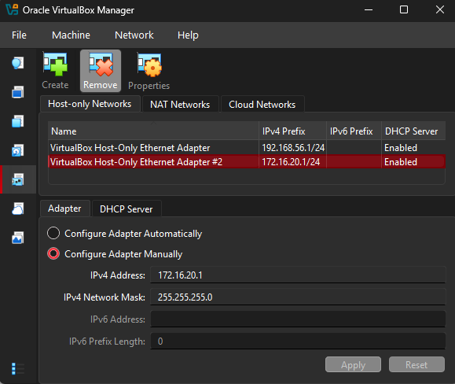
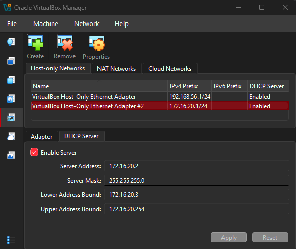

# Sandbox Network and INetSim

## Sandbox Network in Virtual Box

A new Network has to be configured in Virtual Box, of type `Host-Only Network`.

The Host-Only network is configured as shown in the 2 following screenshots:




Once the network is configured, the adapters on both VMs (Remnux and Windows10) are configured to ONLY use the new Host-Only network.

- REmnux is configured with 172.16.20.3
- Windows10 is configured with 172.16.20.4, where it's default gateway and DNS resolver are configured to REmnux's IP address 172.16.20.3.

## REmnux and INetSim

To simulate a network with services, automated binary serving, and a DNS Sinkhole, INetSim is used within REmnux.

### Configuring and Enabling INetSim

INetSim ships pre-configured but for this setup but there are a few items that needed to be changed.

1. The commented `# start_service dns` line gets uncommented: `start_service dns`
2. The commented `# service_bind_address 10.10.10.1` line in the `service_bind_address` network is uncommented and changed to `service_bind_address 0.0.0.0`. This binds the services on all remnux interfaces.
3. In the `DNS Service` section within its `dns_default_ip`, the uncommented line: `# dns_default_ip 10.10.10.1` gets uncommented and the IP changed to REmnux's IP: `dns_default_ip 172.16.20.3`

### DNS Service Error

When running INetSim after the changes with command `sudo inetsim`, there was an error:

```
deprecated method; prefer start_server() at /usr/share/perl5/INetSim/DNS.pm line 69.
Attempt to start Net::DNS::Nameserver in a subprocess at /usr/share/perl5/INetSim/DNS.pm line 69.
```

This error was researched and the fix was found in the following GitHub repo: https://github.com/Seth-Smithey/Malware_Lab/blob/main/inetsim-dns-fix.md

The following steps fixed the issue:

#### Disabling systemd-resolved (frees port 53)

```bash
sudo systemctl disable systemd-resolved --now
sudo rm /etc/resolv.conf
echo "nameserver 127.0.0.1" | sudo tee /etc/resolv.conf
```

#### Step 2 — Patch DNS.pm (fix the Net::DNS API incompatibility)

Replaced `main_loop` with a `loop_once` event loop:

```bash
sudo sed -i 's/\$server->main_loop/\$server->start_server;\n    while(1) { \$server->loop_once(10); }/' /usr/share/perl5/INetSim/DNS.pm
```

Removed the `start_server` call (it double-binds sockets):

```bash
sudo sed -i '/\$server->start_server;/d' /usr/share/perl5/INetSim/DNS.pm
```

#### Step 3 — Allow unprivileged port binding

```bash
sudo sysctl -w net.ipv4.ip_unprivileged_port_start=0
```

Persistence across reboots:

```bash
echo "net.ipv4.ip_unprivileged_port_start=0" | sudo tee -a /etc/sysctl.conf
```
