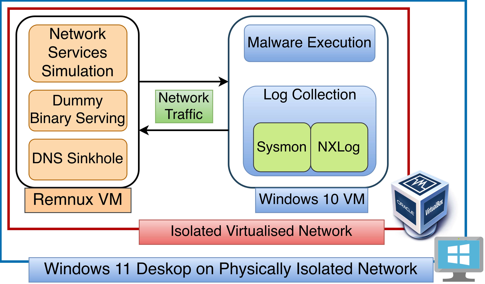

## Lab Infrastructure specifications

### VirtualBox

Version 7.2.12 r174389 (Qt6.8.0 on windows):
SHA256 hash of .\VirtualBox-7.2.12-174389-Win.exe:
5094f3d573fe2a511bfc7ae8982c2f6544ae9b5051048dc7a0e9985c74dcac4c

### Windows 10

Windows 10 Pro, Version 10.0.19045 Build 19045

SHA256 hash of .\Win10_22H2_English_x64v1.iso:
a6f470ca6d331eb353b815c043e327a347f594f37ff525f17764738fe812852e

### Remnux

SHA256 hash of D:\remnux-noble-amd64-virtualbox.ova:
1ba3196ad82f3536954404546aa510ff09cf0c6c0567847272a9389e2e160a7b

After install the following command was run: `remnux install` as per the documentation. Ref: https://docs.remnux.org/install-distro/keep-the-distro-up-to-date

### Sysmon (in Windows 10 machine)

Version 15.21.0.0

SHA256 hash of .\Sysmon.exe: (installer)
e629aff050b07293ce66cb5f220280727daa33b7eeda961554b86e35e8a72c7a

#### Sysmon Configuration

Ref: https://raw.githubusercontent.com/olafhartong/sysmon-modular/master/sysmonconfig.xml

Used as-is, this is widely the accepted practice in most companies as that config is "good enough".

### NXLog (in Windows 10 Machine)

Version CE 3.2.2329

certutil -hashfile .\nxlog-ce-3.2.2329.msi sha256
SHA256 hash of .\nxlog-ce-3.2.2329.msi:
015d546d0b1a31cf10a6dd00d36f5e17503eaf45c164f73b6e578970c08da082
CertUtil: -hashfile command completed successfully.

## Architecture

