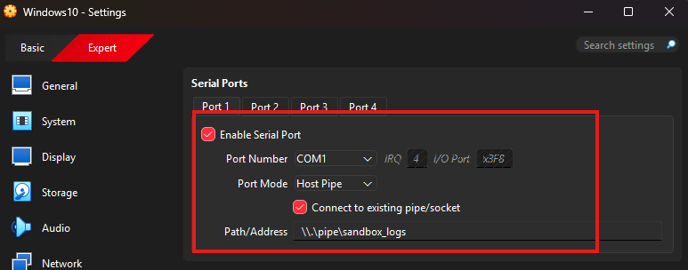
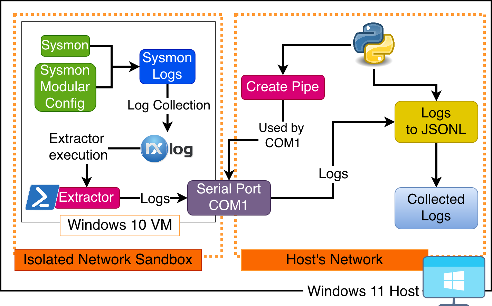

# SysMon Log Extraction

Extracting the logs from the Windows VM is a challenge as the sandbox is fully isolated from any other network. To accomplish this, a Serial port is used.

The machine gets configured with a serial device (image below) and the setting to use an existing pipe. A pipe (or named pipe) is a kernel-created file that allows for unrelated process to read and write data.



With this setup, a pipe is created with a Python Script on the host, then internally, NXLogs (sysmon) get collected and routed through the COM1 serial port, using the created pipe and being written to a `.jsonl` file.

Diagram of Sysmon Log Extraction:


## Python Script

The [python script](../../src/sandbox/serial_monitor.py) works as follows:

1. A Named Pipe is created: `\\.\pipe\sandbox_logs`
2. It then waits for the VM to get connected to the pipe.
3. The VM connects to the pipe and it starts writing logs to the `OUTPUT_FILE` (as long as logs are coming through the port).
4. If the VM disconnects (shutdown), it starts again, waiting for it to connect.

## Sysmon and NXLog Collector

Sysmon is configured in the machine following the  from Olaf Hartong and using the `default` xml file.

However, sysmon on its own does not forward logs. NXLog is the collector for the Sysmon logs with the configuration defined [here](../../src/sandbox/nxlog.conf).

This config uses the following config:

```conf

<Input sysmon>
    Module  im_msvistalog
    <QueryXML>
        <QueryList>
            <Query Id="0">
                <Select Path="Microsoft-Windows-Sysmon/Operational">*</Select>
            </Query>
        </QueryList>
    </QueryXML>
    Exec    to_json();
</Input>

<Output serial>
    Module om_exec
    Command "C:\Windows\System32\WindowsPowerShell\v1.0\powershell.exe"
    Arg "-ExecutionPolicy"
    Arg "Bypass"
    Arg "-File"
    Arg "C:\Windows\System32\scripts\sysmon-serial-extractor.ps1"
</Output>
```

That finds the Sysmon Logs `<Select Path="Microsoft-Windows-Sysmon/Operation">`, and parses them to json `Exec to_json();`. Then the `<Output serial>` config executes the powershell [sysmon-serial-extractor.ps1](../../src/sandbox/sysmon-serial-extractor.ps1) script which configures the serial port and sends logs out to the host via the created pipe.

### Powershell Script

Debug was enabled during troubleshooting and as something that can be checked before each malware sample is detonated so it confirms that logging is working.

```powershell
$ErrorActionPreference = "Stop"

$debug = "C:\Temp\sysmon-serial-extractor.log"

function Log($msg) {
    "$(Get-Date -Format 'yyyy-MM-dd HH:mm:ss') $msg" | Out-File -FilePath $debug -Append
}

Log "SCRIPT START"

$port = New-Object System.IO.Ports.SerialPorts

$port.PortName = "COM1"
$port.BaudRate = 115200
$port.Parity = [System.IO.Ports.Parity]::None
$port.DataBits = 8
$port.StopBits = [System.IO.Ports.StopBits]::One
$port.Handshake = [System.IO.Ports.Handshake]::None
$port.DtrEnable = $true
$port.RtsEnable = $true
$port.NewLine = "`r`n"
$port.WriteTimeout = 5000

try {
    Log "OPENING SERIAL"
    $port.Open()
    Log "SERIAL OPEN"

    # Test for confirmation that COM1 workds -> Confirmed to work.
    # $port.WriteLine("NXLOG SERIAL TEST")

    Log "SERIAL TEST SENT"

    while ($true) {
        $line = [Console]::In.ReadLine()

        if ($null -eq $line) {
            Log "STDIN CLOSED"
            break
        }

        Log "RX: $line"
        $port.WriteLine($line)

        Log "TX OK"

    }
}
catch {
    Log "ERROR: $($_.Exception.Message)"
}
finally {
    Log "CLOSING"

    if ($port.IsOpen) {
        $port.Close()
    }
}
```
